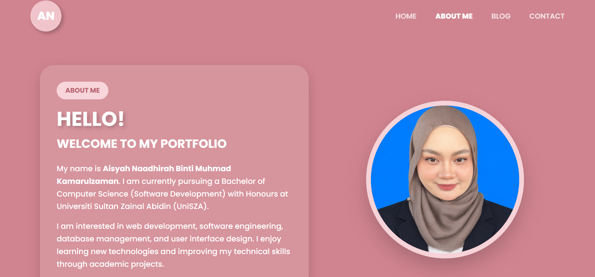
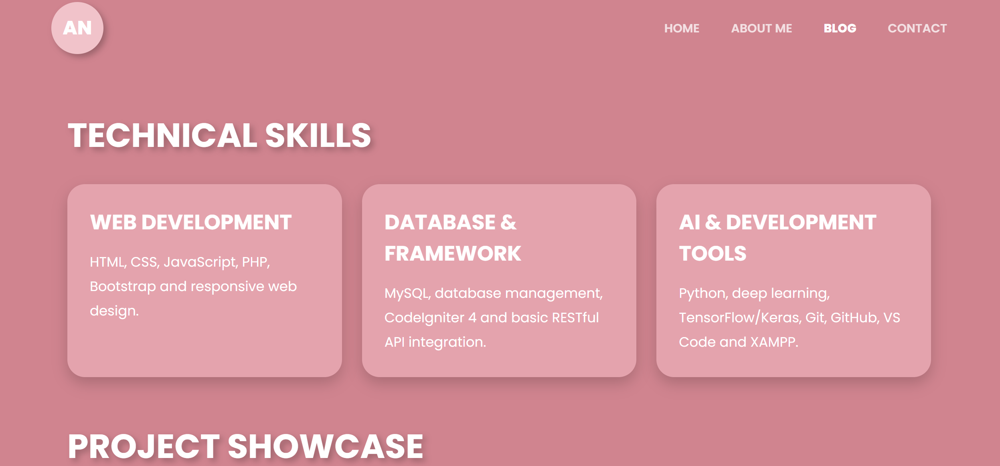
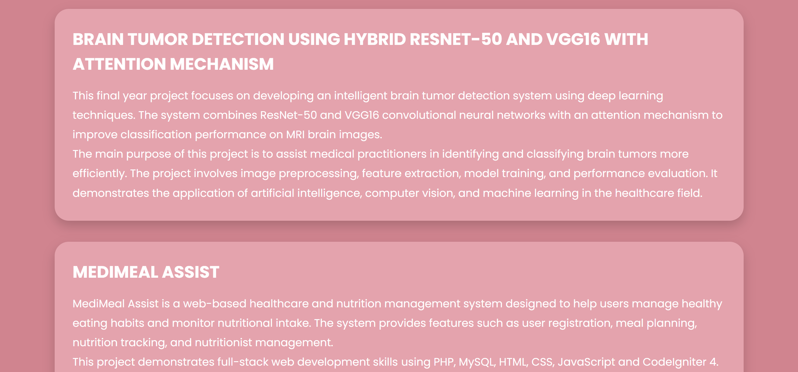
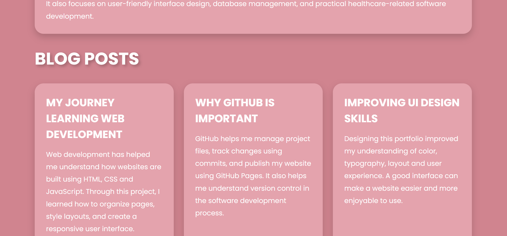
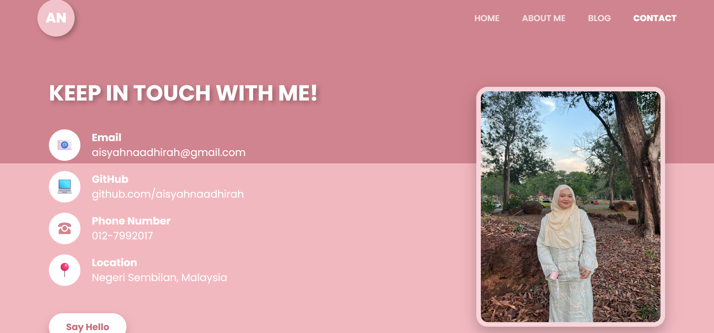

# Personal Blog Portfolio

A personal GitHub project portfolio developed using HTML, CSS and JavaScript.  
This project presents my personal background, blog posts, software project showcase and contact information.

## Features
- Home page
- About page
- Blog page with 3 sample posts
- Project showcase section
- Contact page
- Responsive design
- JavaScript theme interaction
- Deployed using GitHub Pages

## Technologies Used
- HTML5
- CSS3
- JavaScript
- Git
- GitHub

## Screenshots
- Homepage

- About

- Blog

- Contact

## How to Run
1. Download or clone this repository.
2. Open `index.html` in a web browser.

## Demo Link
- **GitHub Repository:**

https://github.com/aisyahnaadhirah/personal-blog-page

- **Live Website (GitHub Pages):**

https://aisyahnaadhirah.github.io/personal-blog-page/

## Author
Aisyah Naadhirah